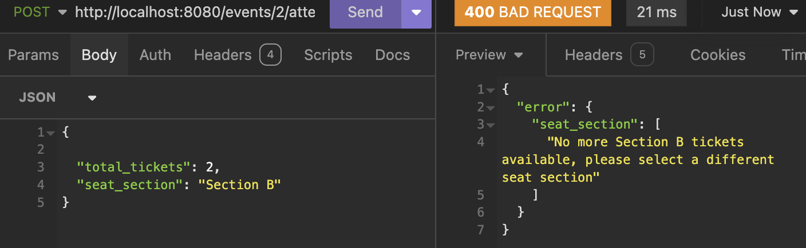
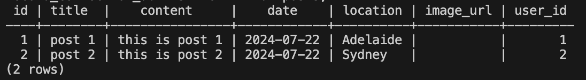
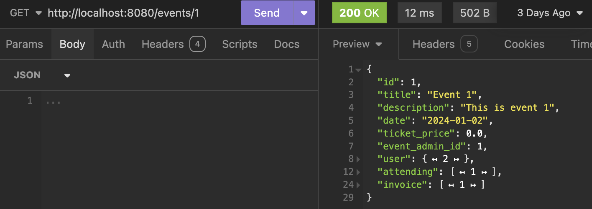

# T2A2: API Webserver

## Work in Progress

## Event Ticketing & Communication RESTful API Application

The main tech-stack used for this application includes:

* Python <br>

 <br>
* Flask
* PostgrsSQL
* SQLAlchemy


 
---

### R1. Explain the problem that this app will solve, and explain how this app solves or addresses the problem.

This application addresses several key issues related to event management and social interactions around events. The primary problem it solves is providing a secure and efficient platform for users to manage event access, ticketing, and communication with friends.

### Problem and Solution Overview:

Based on feedback from friends, online reviews, and my own experience, the event ticketing platforms in Australia fall short of customer expectations. Here are the ratings for two of the largest ticket providers in the country:

**Ticketek Review** <br>
 <br>

**Eventbrite Review** <br>
 <br>

Their user experience (UX) and user interface (UI) are outdated and challenging for some users. This application aims to address these fundamental issues, offering all users a smooth and enjoyable experience from purchasing tickets, arranging flights and accomodation, to organising the entire event. This app has you covered.

**Secure Account Creation and Event Access:**

Problem: Users need a secure way to create accounts and manage their personal information while accessing events and ticketing options. <br>
Solution: The app allows users to create private, secure accounts protected by hashed passwords using the bcrypt library. Users can log in with their credentials, and a JWT token is issued for secure session management. This token verifies the user's identity for all interactions, ensuring data integrity and privacy.

**Event Communication and Engagement:**

Problem: Users need a platform to discuss events, gauge interest, and communicate with friends.<br>
Solution: Users can post about events, and friends can comment and like these posts, facilitating communication and interest gauging. Additionally, a private messaging feature allows friends to discuss event details securely.

**Integrated Ticketing and Seating Management:**

Problem: Users want to purchase tickets and select seats, often wanting to sit together but pay separately.<br>
Solution: The app provides ticketing and seating options, allowing users to select seats next to their friends while handling payments individually. An invoice linked to the payee is issued, streamlining the process.

**Event Creation and Sharing:**

Problem: Users need a way to create events, manage ticketing, and share events with a broader audience.<br>
Solution: Users can create events with ticketing and seating options and share these events with their friends through posts. Friends can further share the posts, increasing event exposure. The app supports both small and large-scale events, making it versatile for various event types.

**Revenue Generation through Recommendations:**

Problem: Users often need assistance planning additional aspects of their event experience, such as dining and transportation.<br>
Solution: The app suggests related expenses and services, such as nearby restaurants, transportation options, and other activities. For instance, if a user is attending a concert, the app might recommend a highly-rated restaurant nearby and arrange a taxi or Uber if needed.

**User-Friendly Search and Interaction:**

Problem: Users need an efficient way to find friends and events without needing exact spellings.<br>
Solution: The app allows partial string searches, returning results that include any part of the search input. For example, searching for 'my' would return 'Tommy', 'Amy', 'Sammy', etc.

**Comprehensive Data Management:**

Problem: Users and admins need to manage various data types related to events, posts, comments, and more.<br>
Solution: Users can create, view, update, and delete data they have created, with admins having full authorisation to manage the app's data. Data validation ensures that the correct information is stored, such as validating email formats and password strength.

**Seating Section and Ticket Limits:**

Problem: Users need to choose specific seating sections and ensure ticket limits are enforced.<br>
Solution: The app provides different seating sections (General Admission, Section C, B, A, VIP) and enforces limits on ticket sales per section. A CLI function allows checking the total tickets sold for an event.

**Total Tickets Sold** <br>
 <br>

**Seating Section Limitations** <br>
 <br>

This comprehensive application effectively addresses the needs of users looking to manage events, communicate with friends, and handle ticketing in a secure and user-friendly manner. Furthermore, not all functionalities mentioned in the above solutions will be implemented in the initial API route design due on the 28th of July. These include the AI suggestions, seat number selection, dynamic total cost invoices, and private messaging.

---

### R2. Describe the way tasks are allocated and tracked in your project.

For this project tasks were allocated and tracked using Atlassian's project management tool 'Trello'. 


Public link to the applications [Trello Board](https://trello.com/invite/b/MSNeGTDP/ATTIbcf6438a9f232f88791835689a108779C4AF2FEE/event-ticketing-api).

* Friday the 12th of July '24 update

Initiated board and populated all cards with required functionality.


* Monday the 15th of July '24 update

Completed readme requirements 1 and 2, plus models and route controllers for Users, Posts and Comments. 


* Tuesday the 16th of July '24 update

Completed the models and route controllers for Events, Attendees and Ivoices. 


* Wednesday the 17th of July '24 update

Completed the models and route controllers for likes. Completed validation and started on Authorisation.  


* Thursday the 18th of July '24 update

Today marks the mid-point of the assignment timeline, so I assessed the importance of the tasks and what would be most beneficial for the assignment and overall learning outcome. Since the code was fresh in my mind, I decided that the most efficient and beneficial approach was to finish the validation and authorisation tasks before tackling the README requirements due today. This decision was approved because I have completed more than 60% of the assignment at the half-way point and wanted to continue working on the code until it functions as desired. This was a good decision because I struggle to move on to a new task if the current task is not completed to a satisfactory standard, which can then be detrimental to the new task.

I, therefore, changed the due dates of README requirements 4 and 5 to the 23rd of July. This will allow me plenty of time to get my code functioning without errors and with the required validation and authorisation, which is taking longer than anticipated.


* Saturday the 20th of July '24 update

After a Zoom meeting with my lecturer Simon in the morning, I created a new 'search' card on the Trello board. This card required implementing a search function that allows clients to search for either a user_name or event_name via the URL. The search needed to support partial matches and return a list of results if there were multiple matches. I completed this functionality shortly after and moved the card to the newly renamed 'completed' column. Additionally, I marked readme requirement 4 as completed and created a new card for readme requirement 8, which had been overlooked during the initial project management phase.


* Monday the 22nd of July '24 update

Completed readme requirements 3, 5 and 8, added error handling card to the Trello board. 


* Tuesday the 23rd of July '24 update

Completed readme requirements 6 and 7, starting working on the comments and error handling cards. 


---

### R3 List and explain the third-party services, packages and dependencies used in this app.

Below describes the third party services, packages or dependencies that are used in the developed application. With greater detail provdided for those that are installed directly using pip or pip3. 

### Flask


Flask is a lightweight WSGI web application framework for Python, designed to enable quick and easy development of web applications. It follows a simple, modular design that allows developers to choose the components they need, making it highly flexible and extensible. Flask supports extensions for adding functionality like form validation, authentication, and database integration. Its simplicity and ease of use make it an ideal choice for both beginners and experienced developers looking to build scalable and maintainable web applications.

### Marshmallow


Marshmallow is a framework-agnostic library for serializing and deserializing complex data types, such as objects, into native Python datatypes. It simplifies data validation and transformation, enabling seamless conversion between Python objects and data formats like JSON. Marshmallow's flexibility and ease of use make it an invaluable tool for managing data in web APIs, database integrations, and other data-intensive applications.

### SQLAlchemy 


SQLAlchemy is a comprehensive SQL toolkit and Object Relational Mapper (ORM) for Python, offering developers extensive power and flexibility with SQL. It allows for full control over SQL statements, supports complex queries, and facilitates the management of database schemas. By bridging the gap between Python objects and relational database tables, SQLAlchemy streamlines database interactions, making it easier to build and maintain scalable applications.

### bcrypt


Bcrypt is a cryptographic hash function designed to securely store passwords by transforming them into a fixed-length string using a one-way hash function, making it irreversible. It adds a random "salt" to each password to ensure unique hashes, and employs a "cost factor" to determine the number of iterations for hashing, enhancing security by making it computationally expensive to crack. Bcrypt is favored over faster algorithms like SHA256 for password storage due to its resistance to brute force and dictionary attacks.

### Psycopg2-binary


Psycopg2-binary is a production-ready PostgreSQL adapter for Python, designed to facilitate the connection and interaction between Python applications and PostgreSQL databases. It provides efficient, high-performance database access, supporting advanced features like asynchronous communication and notification, COPY command support, and more. 

#### Flask-JWT-Extended


JWT-Extended is a Flask extension that provides robust support for JSON Web Tokens (JWTs), enhancing security in Flask applications by allowing developers to create, manage, and validate JWTs easily. It includes features like token refreshing, complex access control, and various token storage options, making it versatile for handling authentication and authorization in modern web applications. JWT-Extended simplifies implementing secure user authentication workflows, ensuring sensitive information is safely transmitted between clients and servers.

### python-dotenv


Dotenv, or .env, is a simple module that loads environment variables from a .env file into a project's environment. This file typically contains key-value pairs, such as API keys, database URLs, and other configuration settings, allowing developers to manage sensitive information and configuration details separately from the codebase. By keeping these variables in a .env file, it enhances security and makes it easier to configure different environments (e.g., development, testing, production) without altering the code.

### App third-party services not mentioned above

* blinker
    - Blinker is a Python library that provides a fast, simple, and flexible way to create signal/event handling systems, allowing different parts of an application to communicate with each other through signals.
* click
    - Click is a Python package used to create command-line interfaces (CLI) with minimal code, providing functionality for handling arguments, options, and commands in a user-friendly way.
* Flask-Bcrypt
    -  Flask-Bcrypt is a Flask extension that provides bcrypt hashing utilities for hashing passwords, making it easier to implement secure password storage in Flask applications.
* flask-marshmallow
    - Flask-Marshmallow provides a thin integration layer for Flask and Marshmallow, enhancing Marshmallow with additional features tailored for Flask applications.
* Flask-SQLAlchemy
    - Flask-SQLAlchemy is an extension that simplifies the integration of SQLAlchemy into Flask applications, making database interactions more straightforward.
* itsdangerous
    - itsdangerous is a Python library that provides various helpers to pass data to untrusted environments in a safe way, most notably used for creating and validating secure signed tokens.
* Jinja2
    - Jinja2 is a fast, extensible templating engine for Python, designed to generate HTML, XML, and other markup formats by combining static templates with dynamic data.
* MarkupSafe
    - MarkupSafe is a Python library used to safely handle and render text in web applications by escaping characters that could introduce security vulnerabilities, such as cross-site scripting (XSS) attacks. It ensures that any text marked as safe remains unchanged while potentially dangerous characters are properly escaped.
* marshmallow-sqlalchemy
    - Marshmallow-SQLAlchemy integrates Marshmallow's serialization and deserialization capabilities with SQLAlchemy, facilitating the conversion of SQLAlchemy models to and from Python datatypes.
* packaging
    - Packaging is a Python library that provides utilities for working with Python package metadata, including version parsing, dependency resolution, and other tasks related to managing Python package distributions.
* PyJWT
    - PyJWT is a Python library used for encoding and decoding JSON Web Tokens (JWT), which are commonly used for securely transmitting information between parties as a JSON object.
* typing_extensions
    - typing_extensions is a Python library that provides backports of new type hinting features introduced in recent versions of Python, allowing developers to use these features in older versions of the language.
* Werkzeug
    - Werkzeug is a comprehensive WSGI (Web Server Gateway Interface) utility library for Python that provides a range of tools to build web applications, including request and response handling, URL routing, and debugging support. It is a core component of the Flask web framework.

---

### R4. Explain the benefits and drawbacks of this app’s underlying database system.

There were a few different database management systems (DBMS), both free and paid, that could have been used as the underlying database for this API project. A few of these include:

* Oracle Database
* MySQL
* PostgreSQL
* Redis
* SQLite
* MongoDB
* Elasticsearch
* IBM Db2
* Microsoft Access

As you can probably see by the name, most of the databases listed above use the SQL language, to create, populate, retrieve, delete and update the data stored in their database. In each case of these different databases that use the SQL language, their basic syntax may differ slightly. 

For this question we will be discussing the pro and cons of PostgreSQL, because it was used for this app's underlying database system. 


PostgreSQL was one of the first DBMS’s to be created and is still used frequently for web databases found in industry today. It is a free, open-source database, that allows users to control structured and unstructured data. It is a highly flexible database and is used across many industries and scenarios. It is an object relational database, which means that it includes both relational and object-orientated databases. It also can communicate with other modern frameworks such as Ruby on Rails, Node.js or Django. (Object-Relational Database Management System n.d.). A postgreSQL environment can be hosted virtually, physically and in the cloud, and can be used on most operating systems and platforms (such as Linux) (Arsenault 2017). 

**Pro's**

* The engine of the database system is scalable. 
* The software is open source.
* Large variety of supported languages (C++, C, PHP, Perl, Java, and of course Python).
* The database supports the commonly used JSON language to communicate with APIs. 
* The database system is cross platform.
* The database system comes with many premade functions to simplify interaction with the database. 
* The database uses a ‘multi-model’ system that works with Semi-Structured Data (JSON, XML), Structured Data (SQL), Key-Value and Spatial Data. 
* It comes as the standard database for any Mac running OSX Lion 10.7 or higher.
* The software uses around only 20 MB. 
* The database is accessible via the terminal.
* There are many Graphical User Interfaces (GUI) that aid in the ease of interaction with the database system. Some of these include:
    - pgAdmin
    - DataGrip
    - TablePlus
    - DBeaver
    - Postbird
    - OmniDB
    - Navicat
* The database system can store and handle large amounts of data.

 
(PostgreSQL: a closer look at the object-relational database management system n.d.)


**Con's**

* Documentation can be more difficult to find than some other competing database systems and expandable documentation is often only in English.
* The configuration method can be confusing to some. 
* In the case of large operations, the speed of execution may slow. 

(Arsenault 2017)

Given these pros and cons, postgrSQL is an ideal database system for those with a limited budget, who may want to scale at some point in the future, value being able to choose their interface, or, for those who want to use the JSON. 

---

### R5. Explain the features, purpose and functionalities of the object-relational mapping system (ORM) used in this app.

Firstly, lets define what an Object Relational Model (ORM) is. 

According to freecodecamp.com, ‘Object Relational Mapping (ORM) is a technique used in creating a "bridge" between object-oriented programs and, in most cases, relational databases (Abba 2022).’

For example, here is a query in SQL that retrieves data about a user. 


While using an ORM tool the same query can be written like this:  


### Some popular Python ORM’s include
-	Django
-	Web2py
-	SQLObject
-	SQLAlchemy

The Object Relational Mapping system or ORM used for this application is SQLAlchemy. 


And put in a way relating to our API application, SQLAlchemy is the layer that interacts with the Postgres relational database using SQL language via its own querying methods and an object-oriented programming language like Python. 

#### Some of its main features include:

- **SQL Expression Language**: SQLAlchemy provides a comprehensive suite of well-known enterprise-level persistence patterns, designed to facilitate efficient and high-performing database access. It enables the creation of SQL queries in a Pythonic way, abstracting the complexities of SQL while offering a powerful and flexible way to interact with databases.

- **ORM**: The Object-Relational Mapper (ORM) offers a high-level API for working with database records as Python objects, making it easier to interact with the database using Python code. It supports complex object relationships, lazy loading, and polymorphic inheritance, allowing developers to work with data in a more intuitive and object-oriented manner.

- **Database Connectivity**: SQLAlchemy supports a wide range of major relational databases, including PostgreSQL, MySQL, SQLite, Oracle, and Microsoft SQL. This ensures compatibility and flexibility, allowing developers to choose the database that best fits their needs without worrying about compatibility issues.

- **Schema Generation**: Automatically generating database schemas from Python classes reduces the need for manual schema creation. This feature ensures that the database schema is always in sync with the application's data models, simplifying development and maintenance.

- **Schema Migration**: SQLAlchemy integrates with Alembic, a lightweight database migration tool for handling database migrations. This integration makes it easy to manage schema changes over time, ensuring that the database evolves with the application without manual intervention.

- **Transactions**: Full support for database transactions ensures data integrity and consistency. SQLAlchemy allows developers to manage transactions easily, providing control over the commit and rollback operations to handle data safely and effectively.

- **SQL Compilation**: SQLAlchemy compiles Python expressions into SQL statements, offering a powerful and expressive way to generate SQL queries. This feature allows developers to write complex queries using Python syntax, making the code more readable and maintainable.

- **Performance**: SQLAlchemy optimizes database access through various techniques such as connection pooling, which reuses database connections, and query caching, which stores the results of frequently executed queries. These optimisations enhance the performance and scalability of database interactions.

- **Extensibility**: Designed with extensibility in mind, SQLAlchemy allows developers to customise and extend its functionality as needed. It provides hooks and plugins for adding new behaviors and integrating with other developer tools, ensuring that it can adapt to the unique requirements of different projects.

- **Community and Documentation**: SQLAlchemy is backed by a large and active community, providing a wealth of resources, support, and contributions. Comprehensive documentation, including tutorials, guides, and API references, helps developers learn how to use SQLAlchemy effectively and troubleshoot any issues that may occur.

***Referenced from (Features - SQLAlchemy n.d.).***

**Now** let’s look at how the apps code uses the features, purpose and functionalities of SQLAlchemy. 

For this application SQLAlchemy was assigned to 'db', `db = SQLAlchemy()`, and therfore for the code examples every time we see 'db' we are accessing the SQLAlchemy library features. For further understanding of the SQLAlchemy methods used in the following code, such as commit, select, session, filter_by etc. please refer to the end of this answer for a brief explanation. 

**Models** - when creating a table we use an SQLAlchemy class called ‘Model’, `class User(db.Model):`, creates a model class named ‘users’, that represents a table in the database. 


Table Names - we can then assign a name to the Model class, or table, using `__tablename__ = "users"`, that sets the name to ‘users.

**Columns** – we then create the table columns, or attributes, assigning them individual datatypes and constraints. Examples of the datatypes used in the app are:
-	String
-	Integer
-	Date
-	Float
-	Boolean

And examples of the constraints used in the app are:
-	Primary key
-	Foreign key 
-	Unique 
-	Default
-	Nullable

`id = db.Column(db.Integer, primary_key=True)`
Where ‘id’ is a column of the table, with a datatype of integer and is the primary key of the table. 
`user_id = db.Column(db.Integer, db.ForeignKey('users.id')`
Where 'name' is a column of a table, with a datatype of integer, and is a foriegn key of the 'id' attribute from the users table.
`name = db.Column(db.String, nullable=False)`
Where ‘name’ is a column of the table, with a datatype of string and cannot be null. 

**Relationships** - define how different tables or models relate to each other. 

`‘posts = db.relationship("Post", back_populates="user", cascade="all, delete")’`

Let’s break this code down…
-	`db.relationship` is a function that defines that there is a relationship.
-	`”Post”` is the name of the related model.
-	`back_populates=”user”` - specifies the attribute on the related model that points back to the current model. This indicates that the ‘Post’ model has an attribute ‘user’ that points back to the ‘User’ model.
-	` cascade="all, delete"` - determines that all related objects are deleted when the parent object is deleted. For example, when a user is deleted so are the users posts and comments. 

This code connects the Post model and the user field, a user can make multiple posts, but a post can only be created by one user. 

**Database Interaction**

- Determine what data to fetch using `db.select(User).filter_by(id=user_id)`, which selects a User based on the id from the URL path.
- Execute Statement: Execute the statement and retrieve the selected data, storing it in a variable such as user - `user = db.session.scalar(stmt)`. The scalar method executes a query that returns a single result, while scalars can return multiple results.
- Check and Return Data:
    - If the data is found, serialize it and return it to the client in JSON format - `return user_schema.dump(user)`.
    - If the data is not found, return an error message and status code to the client in JSON format - `return {"error": f"User with id {user_id} not found"}, 404`.

**Adding to Session and Commiting**

- `db.session.delete(user)`: This command finds the user object for deletion. The user object is a row in the database that the user is trying to delete. SQLAlchemy keeps track of this in its session.

- `db.session.commit()`: This command commits the current transaction, which includes any pending changes such as the deletion found by db.session.delete(user). When this is called, SQLAlchemy sends the appropriate SQL DELETE statement to the database to remove the record and finalises the database transaction.

**Checking if id Exists**

`event_exists = db.session.query(Event.id).filter_by(id=event_id).scalar() is not None` is used to check if a specific event exists in the database:

`db.session.query(Event.id)`: This creates a query object to select the id column from the Event table. <br>
`.filter_by(id=event_id)`: This filters the query to only include rows where the id matches the event_id passed in the URL path.<br>
`.scalar()`: This executes the query and returns a single value (the first column of the first row) from the result set, or None if no rows match the filter. If it were `.scalars`, this would return all the rows of the result set, or None if no rows match the filter. <br>
`is not None`: This checks if the result of scalar() `is not None`. If the result `is not None`, it means an event with the specified id exists, and the rest of the function can run. If `is not None` is false, then the event with the specified id does not exist and it's probable an error message would be thrown. <br>
Putting it all together, this line of code checks whether an event with the specified `event_id` exists in the database and stores True or False as event_exists. <br>

---

Here are a few of the more common SQLAlchemy methods, most of which are used in this app but not all, and their functionality:

- **commit**: db.session.commit(): Commits the current transaction, saving all changes made during the transaction to the database.

- **delete**: db.session.delete(instance): Marks an instance (record) for deletion from the database. The change is finalized when commit() is called.

- **session**: db.session: Represents the database session used to manage and persist operations on objects and transactions. It's the main interface for interacting with the database.

- **select**: db.select([columns]): Constructs a SQL SELECT statement to query data from the database. It's used to retrieve records based on certain criteria.

- **add**: db.session.add(instance): Adds a new instance (record) to the session to be inserted into the database upon commit.

- **query**: db.session.query(Model): Creates a query object for the specified model, allowing you to retrieve data from the database using various filtering and ordering methods.

- **filter**: query.filter(condition): Adds filtering conditions to a query, returning only the records that match the specified condition.

- **filter_by**: query.filter_by(**kwargs): Adds filtering conditions to a query using keyword arguments to specify column-value pairs.

- **scalar**: query.scalar(): Executes the query and returns a single scalar result, which is the first column of the first row in the result set.

- **scalars**: query.scalars(): Executes the query and returns an iterator of scalar results, which are the values of the first column for all rows in the result set.

- **all**: query.all(): Executes the query and returns all results as a list of instances.

- **first**: query.first(): Executes the query and returns the first result, or None if no result is found.

- **update**: query.update(values): Performs a bulk update operation on the records that match the query's filter conditions, setting the specified column values.

- **rollback**: db.session.rollback(): Rolls back the current transaction, undoing any changes made during the transaction.

***Referenced from (Features - SQLAlchemy n.d.).***

---

### R6. Design an entity relationship diagram (ERD) for this app’s database, and explain how the relations between the diagrammed models will aid the database design.

**Normalisation Definition** - Database normalisation is a database design principle for organising data in an organised and consistent way. It helps you avoid redundancy and maintain the integrity of the database. It also helps to eliminate undesirable characteristics associated with insertion, deletion, and updating (Chris 2022).

The example below is of an unnormalised table. This is because for each ticket purchase entry for a specific event, the title, descripiton, date, time and ticket price will remain constant, making it redundant data. This can be avoided making implenting database normalisation and using different tables for the event details, those attending the event and payable invoice data, which is visiable in this apps final ERD. This app's database design uses normalisation successfully to avoid redundancy and maintain the integrity of the database.

#### Example of an unnormalised Events Table.


**Relationship Examples**

 
(Entity Relationship Diagram 2021) <br>

The only relationships used in this app thus far are 'one and only one' and 'zero to many'. 

A user can create zero to many posts, comments likes, or events, they can attend zero to many events, and therefore, have zero to many invoices. Though, each of these models can only belong to one and only one user, and an invoice can only belong to one event attendee. This relationship may change in the future to implement a joint payment method and/or joint event administration, but at this stage of the build there's only one paying attendee and event creator. 

**Zero to Many** relationship means that the one object can exist even if the other side doesn't, or is zero. An example of this is if a factory can create zero to many products, the factory can exist if no products are being made but no products can be made without a factory. Another example, relative to this app, is no attendees can attend an event that does not exist. 

**One and only One** relationship means that the object can only belong to one other object. For example, a comment on a post can only be made by one user, there is no way two users can create a single comment. 

**Users** <br>
- One user to zero to many posts, linked by foriegn key 'user_id' referencing the id column of the users table. <br>
- One user to zero to many comments, linked by foriegn key 'user_id' referencing the id column of the users table. <br>
- One user to zero to many likes, linked by foriegn key 'user_id' referencing the id column of the users table. <br>
- One user to zero to many events, linked by foriegn key 'event_admin_id' referencing the id column of the users table. <br>
- One user to zero to many attending, linked by foriegn key 'attending_id' referencing the id column of the users table. <br>
**Posts** <br>
- One post to zero to many comments, linked by foriegn key 'post_id' referencing the id column of the posts table. <br>
- One post to zero to many likes, linked by foriegn key 'post_id' referencing the id column of the posts table. <br>
**Events** <br>
- One event to zero to many attending, linked by foriegn key 'event_id' referencing the id column of the events table. <br>
- One event to zero to many invoices, linked by foriegn key 'event_id' referencing the id column of the events table. <br>
**Attending** <br>
- One attending to zero to many invoices, linked by foriegn key 'attending_id' referencing the id column of the attending table.<br>

As explained previously, these foreign key relationships allow for further bidirectional interactivity between the tables and their data using the `relationship` and `back_populates`. 

Below are some basic visual examples displaying the relationships of post and event paths, starting with the user. 

***ERD User Posts Hierachy***

 

***ERD User Events Hierachy***

 

### Initial Draft ERD 
Submitted on the 12th of July for approval.


### Final ERD
Finished on the 23rd of July after the code was completed.


The changes made from the draft ERD to the final will be outlined in the next requirement. 

Talk in database terms, normalisation, relations - one to many etc, 

---

### R7. Explain the implemented models and their relationships, including how the relationships aid the database implementation.

***Delete on Cascade***: 'When we create a foreign key using this option, it deletes the referencing rows in the child table when the referenced row is deleted in the parent table which has a primary key (Babu 2019).' 

For example, if a post is deleted, the comments and likes directly related to that post are deletd too. There's not point in keeping the comment and like data if the post the comment is on has been permanently deleted from the database. 

***back_populates***: is an argument that builds a bidirectional relationship between the two models. It allows for navigation in both ways between the related objects. 

### Users

 

- id - Intger created by Postgres per entry, Primary Key, and therefore automatically NOT NULL. 
- name - String of alphanumeric characters between 3 and 50 long and NOT NULL.
- user_name - String of alphanumeric characters between 3 and 5 long and NOT NULL. 
- password - String hashed by bcrypt, must be more than 8 characters and include a letter and number. 
- email - String requires valid email format between 5 and 120 characters long, must be unique and NOT NULL. 
- dob - Date requires valid date format written as dd/mm/yyyy only.
- is_admin - Boolean, t = True, f = false, default = f. 

If `is_admin` == True, then that user is authorised to delete data entries from all tables within the database. 

The code below builds the relationship between the child models of the users model, it determines that the variables below can only belong to one user but many instances of these models can belong to a user. It also instructs the database to delete the rows of a child model when the relating user primary key is deleted, this is executed by the `cascade="all, delete"`. The `back_populates` allows multiple instances of data in related child models to be accessed by the parent model, and vice versa, when responding to a request when listed in the model's schema. 

```posts = db.relationship("Post", back_populates="user", cascade="all, delete")```<br>
```comments = db.relationship("Comment", back_populates="user", cascade="all, delete")```<br>
```likes = db.relationship("Like", back_populates="user", cascade="all, delete")```<br>
```events = db.relationship("Event", back_populates="user", cascade="all, delete")```<br>
```attending = db.relationship("Attending", back_populates="user", cascade="all, delete")```<br>
<br>
Since a user can have zero or many posts, comments, likes, events or attending, this schema passed each of these as lists of dictionaries, so that JSON can be used, when responding to a request. Here's an example so you're able to visualise what this looks like for this example for the rest of the models that are analysed for this requirement:

 

The lists shown in this example can be viewed by clicking on the arrow pointing to the right, this will display any current data the user has created or updated. This data could be used on a user homepage to inform them of their recent actions. 

ERD Changes 

It was decided to remove the address attribute from the users table that was present in the initial draft ERD, this was decided because there is no valid reasoning for having the address since all communication and ticketing is to be done electronically. This aligns with the app's stance of sustainability and taking the green option where ever possible. 

### Posts

 

- id - Intger created by Postgres per entry, Primary Key, and therefore automatically NOT NULL. 
- title - String of alphanumeric characters that must be at least 3 long and NOT NULL.
- content - String of alphanumeric characters less than 400 long.
- date - Date format automatically populated by the datetime library.
- location - String of alphanumeric characters between 3 and 100 long.
- image_url - String in URL format between 5 and 150 characters long.

Foriegn Keys

- user_id - Integer that references the id column of the users table. NOT NULL. 

Relationships 

When a post is deleted the comments and likes of that specific post are deleted too because `cascade="all, delete`. There is a relationship between the posts model and the user, comments and likes models, this is so a post can be displayed with information regarding who made the post, and the comments and likes associated with that post. A post can have zero to many comments and likes but only one creator (user). 

```user = db.relationship("User", back_populates="posts")``` <br>
```comments = db.relationship("Comment", back_populates="post", cascade="all, delete")``` <br>
```likes = db.relationship("Like", back_populates="post", cascade="all, delete")``` <br>

ERD Changes 

It was decided to add a 'location' attribute to the posts table. This is so users do not have to include this information in their post content, it is also beneficial to the app as it promotes travel and markets different geographic locations. The foreign key relationship between the posts and the events tables was not implemented because a URL, similarly to Facebook, was decided to be a better alternative because users are already familiar with this user experience process. This functionality may need further UX testing and will be discussed and decided on moving forward. 

### Comments

 

- id - Intger created by Postgres per entry, Primary Key, and therefore automatically NOT NULL. 
- content - String of alphanumeric characters less than 400 long and NOT NULL.
- timestamp - Date format automatically populated by the datetime library.

Foriegn Keys

- user_id - Integer that references the id column of the users table. NOT NULL. 
- post_id - Integer that references the id column of the posts table. NOT NULL. 

Relationships 

For a reltionship between two models to exist, both models need the relationship implemented, this allows for a bidirectional relationship seen in previous models. Since a user cannot like a comment at this stage of the build process, there is no current reltionship, moving forward this is a functionality the app will implement. 

```user = db.relationship("User", back_populates="comments")``` <br>
```post = db.relationship("Post", back_populates="comments")``` <br>

ERD Changes 

It was decided to not implement the likes relationship on the comment model to gain more user input. This functionality may need further UX testing and will be discussed and decided on moving forward. 

### Likes

 

- id - Intger created by Postgres per entry, Primary Key, and therefore automatically NOT NULL. 

Foriegn Keys

- user_id - Integer that references the id column of the users table. NOT NULL. 
- post_id - Integer that references the id column of the posts table. NOT NULL. 

Relationships 

For a reltionship between two models to exist, both models need the relationship implemented, this allows for a bidirectional relationship seen in previous models. <br>
```user = db.relationship("User", back_populates="comments")``` <br>
```post = db.relationship("Post", back_populates="comments")``` <br>

ERD Changes 

As previously discussed, it was decided to remove the ability for a user to like a comment to increase user input. This functionality may need further UX testing and will be discussed and decided on moving forward. 

### Events

 

- id - Intger created by Postgres per entry, Primary Key, and therefore automatically NOT NULL. 
- title - String of alphanumeric characters between 3 and 50 long and NOT NULL.
- description - String of alphanumeric characters between 3 and 50 long and NOT NULL.
- date - Date must written as dd/mm/yyyy only.
- ticket_price - String of alphanumeric characters between 3 and 50 long and NOT NULL.

Foreign Keys

- event_admin_id - - Integer that references the id column of the users table. NOT NULL.

Relationships

When an event is deleted from the database, so are the attending and invoice model data for that event. An automatic refund function will be implemented in the next phase of the build process if the event is cancelled (deleted) before the event has taken place. The event model has a bidirectional relationship with the user, attending and invoice models. This is useful when the client wants to know what seats are available while using the events route for example. 

```user = db.relationship("User", back_populates="events")``` <br>
```attending = db.relationship("Attending", back_populates="event", cascade="all, delete")``` <br>
```invoice = db.relationship("Invoice", back_populates="event", cascade="all, delete")``` <br>

ERD Changes 

As previously discussed, it was decided to remove the ability for a user to make a post with a related event. This functionality may need further UX testing and will be discussed and decided on moving forward. 

### Attending

 

- id - Intger created by Postgres per entry, Primary Key, and therefore automatically NOT NULL. 
- total_tickets - Integer <= MAX_TICKETS_PER_USER, default = 1 ticket.
- seat_section - String OneOf VALID_SEAT_SECTIONS if < count input limit, default = General Admission.
- timestamp - - Date format automatically populated by the datetime library.

Foriegn Keys

- event_id - Integer that references the id column of the events table. NOT NULL. 
- attending_id - Integer that references the id column of the users table. NOT NULL. 

Relationships

When an event attendee data is deleted from the database, so is the invoice model data for that attendee. The attendee model has a bidirectional relationship with the user, event and invoice models. This is useful when the client wants to read the event ticket price while on the attending route for example. 

```user = db.relationship("User", back_populates="attending")``` <br> 
```event = db.relationship("Event", back_populates="attending")``` <br>
```invoice = db.relationship("Invoice", back_populates="attending", cascade="all, delete")``` <br>

ERD Changes

It was decided to add a seat section attribute so that a seating limit fucntion could be assigned to each sub section - General Admission, Section C, Section B, Section A and VIP. A time stamp was also added to limit confusing should there be any around the purchasing of tickets and events selling out.  

### Invoices

 

- id - Intger created by Postgres per entry, Primary Key, and therefore automatically NOT NULL. 
- total_cost - Float datatype with a default value of 0.00.
- timestamp - Date format automatically populated by the datetime library.

Foriegn Keys

- event_id - Integer that references the id column of the events table. NOT NULL. 
- attending_id - Integer that references the id column of the users table. NOT NULL. 

Relationships

For a relationship between two models to exist, both models need the relationship implemented, this allows for a bidirectional relationship seen in previous models. 

```event = db.relationship("Event", back_populates="invoice")``` <br>
```attending = db.relationship("Attending", back_populates="invoice")``` <br>

SQLAlchemy terms - back populates, cascade
Reasoning behind any changes to the ERD

ERD Changes

No changes to the invoice ERD model were made. 

---

### R8. Explain how to use this application’s API endpoints. Each endpoint should be explained, including the following data for each endpoint:

Below is an explanation of each endpoint / route used in the app.       

Including:
* HTTP verb (get, post, patch, put)
* Path or route ("/posts/1/comments/1" etc)
* Any required body or header data - what the payload will look like (get or delete don't require body), authorisation header - 
* Response - structure of a sample response with examples

For the application endpoints below, those with methods GET and DELETE, do not require any body data. The example screenshots taken from Insomnia with those methods, the body data that is sometimes visable, is part of the JWT Bearer Token consisting of what appears to be random characters. 

For a regular (not admin) user to delete or update data from a table, they must be the creator of that data, so we can use `get_jwt_identity()` to check the identity of the user and match it against the user identity who created the data. This can be written as `str(invoice.attendee_id) != get_jwt_identity()`, where 'invoice', is the data the user is trying to update or delete. 

To perform all the queries below, besides register and login, an active JWT token must be attached to the user making the query for it to be successful. This means that a user must be logged in to make CRUD relational database queries. 

### Error Handling

When querying data via a URL path that takes one or more inputs, such as event_id, it is important to check whether the previous inputs exist before querying the final input. In the example below, we can see that the route function first checks if the event exists, and if it doesn't it throws an error as seen in the example screenshot below. 

The below examples are of one route, but these error protection processes are taken for every route that requires additional inputs. Additionally, there are error handling repsonses set for the wrong email or password when logging in or checking the validation requirements when registering a new user, these error responses are an important way to notify the client while also limiting the chance of crashing the server. <br>

***Event Exists*** <br>


If the event does exists in the database, the function then checks to see if the attending_id exists in the database, and if it doesn't it throws an error as seen in the example screenshot below.

***Attending Exists*** <br>


If the event and attending id's are both in the database, the function then checks to see if the user exists, and if it doesn't it throws an error as seen in the example screenshot below.

***Invoice Exists*** <br>


This is the same if a user tries to update or delete data they did not create. Example of the response error seen in the screenshot below. 

When trying to update or delete a card where the user identity does not match that of the user who created the data, the response is an error like the one in the screenshot below. 

***Creator Only*** <br>


If an invalid email is used while trying to login, the error response below is thrown. 

***Invalid*** <br>


***Now we will look at each endpoint...***

### Authentication

***Login*** <br>
URL Path: `http://localhost:8080/auth/login` <br>
Method: POST <br>
Authorisation: NA <br>
Description: A user can login using their existing email and password. If a match is found in the database, the user is provided with a JWT token to perform queries that is valid for 24hrs. <br>
Payload & Response: <br>


***Register*** <br>
URL Path: `http://localhost:8080/auth/register` <br>
Method: POST <br>
Authorisation: NA <br>
Description: A user can register to the app, creating their own account with data, including a password and email that is used to create a JWT token that provides them the authority to interact with the app. <br>
Payload & Response: <br>


### Users

***Fetch Users*** <br>
URL Path: `http://localhost:8080/user` <br>
Method: GET <br>
Authorisation: JWT Token <br>
Description: Fetch all users in the database. <br>
Payload & Response: <br>


***Fetch A Specific User*** <br>
URL Path: `http://localhost:8080/user/<int:user_id` <br>
Method: GET <br>
Authorisation: JWT Token <br>
Description: Fetch a specific user from the database using their id. <br>
Payload & Response: <br>


***Search by user_namer*** <br>
URL Path: `http://localhost:8080/search/<string:user_name>` <br>
Method: GET <br>
Authorisation: JWT Token <br>
Description: Search the database for a user or users by user_name using a partial user URL path search. <br>
Payload & Response: <br>
 

***Update a User*** <br>
URL Path: `http://localhost:8080/user/<int:user_id>` <br>
Method: PUT or PATCH <br>
Authorisation: Creators JWT Token <br>
Description: Update user data. Only the creator of the user account can perform this action. <br>
Payload & Response: <br>
 

***Delete a User*** <br>
URL Path: `http://localhost:8080/user/<int:user_id>` <br>
Method: DELETE <br>
Authorisation: Creators JWT Token or Admin and JWT Token<br>
Description: Delete user from database. Only the creator of the user account or an admin can perform this action. <br>
Payload & Response: <br>
 


### Posts

***Fetch Specific Post*** <br>
URL Path: `http://localhost:8080/posts/<int:post_id>` <br>
Method: GET <br>
Authorisation: JWT Token <br>
Description: Fetch a specific post from the database by post_id. <br>
Payload & Response: <br>
 

***Fetch all Posts*** <br>
URL Path: `http://localhost:8080/posts/` <br>
Method: GET <br>
Authorisation: JWT Token <br>
Description: Fetch all posts from the database. <br>
Payload & Response: <br>
 

***New Post*** <br>
URL Path: `http://localhost:8080/posts` <br>
Method: POST <br>
Authorisation: JWT Token <br>
Description: Create a new post. <br>
Payload & Response: <br>
 

***Update a Post*** <br>
URL Path: `http://localhost:8080/posts/<int:post_id>` <br>
Method: PUT or PATCH <br>
Authorisation: Creator JWT Token <br>
Description: Update a post. Only the creator of the user account who made the post can perform this action.  <br>
Payload & Response: <br>
 

***Delete a Post*** <br>
URL Path: `http://localhost:8080/posts/<int:post_id>` <br>
Method: DELETE <br>
Authorisation: Creators JWT Token or Admin <br>
Description: Delete a post by post_id. Only the creator of the user account who made the post or an admin can perform this action. <br>
Payload & Response: <br>
 

### Comments

***Fetch all Comments on a Post*** <br>
URL Path: `http://localhost:8080/posts/<int:post_id>/comments` <br>
Method: GET <br>
Authorisation: JWT Token <br>
Description: Fetch all comments on a post by post_id from database. <br>
Payload & Response: <br>
 

***Fetch a Comment*** <br>
URL Path: `http://localhost:8080/posts/<int:post_id>/comments/<int:comment_id>` <br>
Method: GET <br>
Authorisation: JWT Token <br>
Description: Fetch a specific comment on a post (post_id) using comment_id from database. <br>
Payload & Response: <br>
 

***New Comment*** <br>
URL Path: `http://localhost:8080/posts/<int:post_id>/comments` <br>
Method: POST <br>
Authorisation: JWT Token <br>
Description: Create a new comment on a post. The post with post_id in path must exist. <br>
Payload & Response: <br>
 

***Update Comment*** <br>
URL Path: `http://localhost:8080/posts/<int:post_id>/comments/<int:comment_id>` <br>
Method: PUT or PATCH <br>
Authorisation: Creator JWT Token <br>
Description: Update a comment on an post in database. Only the creator of the user account who made the comment can perform this action. <br>
Payload & Response: <br>
 

***Delete Comment*** <br>
URL Path: `http://localhost:8080/posts/<int:post_id>/comments/<int:comment_id>` <br>
Method: DELETE <br>
Authorisation: Creator JWT Token or Admin <br>
Description: Delete a comment. Only the creator of the user account who made the post comment or an admin can perform this action. <br>
Payload & Response: <br>
 

### Likes

***Fetch Likes on a Post*** <br>
URL Path: `http://localhost:8080/posts/<int:post_id>/likes` <br>
Method: GET <br>
Authorisation: JWT Token <br>
Description: Fecth a all likes on a post from database. <br>
Payload & Response: <br>
 

***Like a Post*** <br>
URL Path: `http://localhost:8080/posts/<int:post_id>/likes` <br>
Method: POST <br>
Authorisation: JWT Token <br>
Description: Like a post and store the data in database. <br>
Payload & Response: <br>
 

***Delete a Like*** <br>
URL Path: `http://localhost:8080/posts/<int:post_id>/likes/<int:like_id>` <br>
Method: DELETE <br>
Authorisation: Creators JWT Token or Admin <br>
Description: Delete a like from database. Only the creator of the user account who made the like or an admin can perform this action. <br>
Payload & Response: <br>
 

### Events

***Fetch Events*** <br>
URL Path: `http://localhost:8080/events` <br>
Method: GET <br>
Authorisation: JWT Token <br>
Description: Fetch all events from database. <br>
Payload & Response: <br>
 

***Fetch Specific Event*** <br>
URL Path: `http://localhost:8080/events/<int:event_id>` <br>
Method: GET <br>
Authorisation: JWT Token <br>
Description: Fetch a specific event from database. <br>
Payload & Response: <br>
 

***Search for Event*** <br>
URL Path: `http://localhost:8080/events/search/<string:event_title>` <br>
Method: GET <br>
Authorisation: JWT Token <br>
Description: Search the database for an event or events by event title using a partial user URL path search. <br>
Payload & Response: <br>
 

***New Event*** <br>
URL Path: `http://localhost:8080/events` <br>
Method: POST <br>
Authorisation: JWT Token <br>
Description: Create a new event. <br>
Payload & Response: <br>
 

***Update Event*** <br>
URL Path: `http://localhost:8080/events/<int:event_id>` <br>
Method: PUT or PATCH <br>
Authorisation: Creators JWT Token <br>
Description: Update an event in database. Only the creator of the user account who made the event can perform this action.  <br>
Payload & Response: <br>
 

***Delete Event*** <br>
URL Path: `http://localhost:8080/events/<int:event_id>` <br>
Method: DELETE <br>
Authorisation: Creators JWT Token or Admin<br>
Description: Event an event in database. Only the creator of the user account who made the event or an admin can perform this action. <br>
Payload & Response: <br>
 

### Attending

***Fetch All Attending an Event*** <br>
URL Path: `http://localhost:8080/events/<int:event_id>/attending` <br>
Method: GET <br>
Authorisation: JWT Token <br>
Description: Fetch all attendees of an event by event id from database.  <br>
Payload & Response: <br>
 

***Fetch Specific Attending*** <br>
URL Path: `http://localhost:8080/events/<int:event_id>/attending/<int:attending_id>` <br>
Method: GET <br>
Authorisation: JWT Token <br>
Description: Fetch a specific event attendee from database. <br>
Payload & Response: <br>
 

***New Attending*** <br>
URL Path: `http://localhost:8080/events/<int:event_id>/attending` <br>
Method: POST <br>
Authorisation: JWT Token <br>
Description: Create new attendee of an event. <br>
Payload & Response: <br>
 

***Update Attending*** <br>
URL Path: `http://localhost:8080/events/<int:event_id>/attending/<int:attending_id>` <br>
Method: PUT or PATCH <br>
Authorisation: Creator JWT Token <br>
Description: Update an attendee data in database. Only the creator of the user account who is attending the event can perform this action.  <br>
Payload & Response: <br>
 

***Delete Attending*** <br>
URL Path: `http://localhost:8080/events/<int:event_id>/attending/<int:attending_id>` <br>
Method: DELETE <br>
Authorisation: Creator JWT Token or Admin <br>
Description: Delete attendee data from the database by id. Only the creator of the user account who is attending the event or an admin can perform this action. <br>
Payload & Response: <br>
 

### Invoice

***Fetch Attending Invoice*** <br>
URL Path: `http://localhost:8080/events/<int:event_id>/attending/<int:attending_id/invoice` <br>
Method: GET <br>
Authorisation: JWT Token <br>
Description: Fetch an event attendee invoice or invoices from the database by attending id. <br>
Payload & Response: <br>
 

***Fetch Specific Invoice*** <br>
URL Path: `http://localhost:8080/events/<int:event_id>/attending/<int:attending_id/invoice/<int:invoice_id>` <br>
Method: GET <br>
Authorisation: JWT Token <br>
Description: Fetch a specific attendee invoice from database by invoice id.  <br>
Payload & Response: <br>
 

***New Invoice*** <br>
URL Path: `http://localhost:8080/events/<int:event_id>/attending/<int:attending_id/invoice` <br>
Method: POST <br>
Authorisation: JWT Token <br>
Description: Create a new invoice for an attendee to store in the database. <br>
Payload & Response: <br>
 

***Update Invoice*** <br>
URL Path: `http://localhost:8080/events/<int:event_id>/attending/<int:attending_id/invoice/<int:invoice_id>` <br>
Method: PUT or PATCH <br>
Authorisation: Creator JWT Token <br>
Description: Update an invoice data in database. It is important that invoice data cannot be edited by a regular user, so only an admin can perform this action. <br>
Payload & Response: <br>
 

***Delete Invoice*** <br>
URL Path: `http://localhost:8080/events/<int:event_id>/attending/<int:attending_id/invoice/<int:invoice_id>` <br>
Method: DELETE <br>
Authorisation: Creator JWT Token or Admin<br>
Description: Delete invoice data from the database by id. Only an admin can perform this action.  <br>
Payload & Response: <br>
 

## Reference List

LLM disclosure: ChatGPT4 was used while writing this readme.md file for grammar and punctuation. Prompting such 'Please improve grammar and punctuation by rewriting this content using mostly my words:' was used. The data was checked for hallucinations and provided with content written  firslty by myself. 