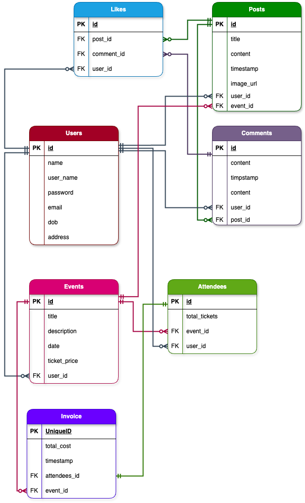

# T2A2: API Webserver

## Event Ticketing & Communication RESTful API Application

### R1. Explain the problem that this app will solve, and explain how this app solves or addresses the problem.

### R2. Describe the way tasks are allocated and tracked in your project.

##### Trello Board 

* 12th July '24

Initiated board and added all tasks.

### R3 List and explain the third-party services, packages and dependencies used in this app.

* bcrypt
* blinker
* click
* Flask
* Flask-Bcrypt
* Flask-JWT-Extended
* flask-marshmallow
* Flask-SQLAlchemy
* itsdangerous
* Jinja2
* MarkupSafe
* marshmallow
* marshmallow-sqlalchemy
* packaging
* psycopg2-binary
* PyJWT
* python-dotenv
* SQLAlchemy
* typing_extensions
* Werkzeug

### R4. Explain the benefits and drawbacks of this app’s underlying database system.

There were a few different database management systems (DBMS), both free and paid, that could have been used as the underlying database for this API project. A few of these include:

* Oracle Database
* MySQL
* PostgreSQL
* Redis
* SQLite
* MongoDB
* Elasticsearch
* IBM Db2
* Microsoft Access

As you can probably see by the name, most of the databases listed above use the SQL language, to create, populate, retrieve, delete and update the data stored in their database. In each case of these different databases that use the SQL language, their basic syntax may differ slightly. 

For this question we will be discussing the pro and cons of PostgreSQL, because it was used for this app's underlying database system. 

PostgreSQL was one of the first DBMS’s to be created and is still used frequently for web databases found in industry today. It is a free, open-source database, that allows users to control structured and unstructured data. It is a highly flexible database and is used across many industries and scenarios. It is an object relational database, which means that it includes both relational and object-orientated databases. It also can communicate with other modern frameworks such as Ruby on Rails, Node.js or Django. (Object-Relational Database Management System n.d.). A postgreSQL environment can be hosted virtually, physically and in the cloud, and can be used on most operating systems and platforms (such as Linux) (Arsenault 2017). 

##### PROS

* The engine of the database system is scalable. 
* The software is open source.
* Large variety of supported languages (C++, C, PHP, Perl, Java, and of course Python).
* The database supports the commonly used JSON language to communicate with APIs. 
* The database system is cross platform.
* The database system comes with many premade functions to simplify interaction with the database. 
* The database uses a ‘multi-model’ system that works with Semi-Structured Data (JSON, XML), Structured Data (SQL), Key-Value and Spatial Data. 
* It comes as the standard database for any Mac running OSX Lion 10.7 or higher.
* The software uses around only 20 MB. 
* The database is accessible via the terminal.
* There are many Graphical User Interfaces (GUI) that aid in the ease of interaction with the database system. Some of these include:
* pgAdmin
* DataGrip
* TablePlus
* DBeaver
* Postbird
* OmniDB
* Navicat
* The database system can store and handle large amounts of data.

 
(PostgreSQL: a closer look at the object-relational database management system n.d.)

##### CONS 

* Documentation can be more difficult to find than some other competing database systems and expandable documentation is often only in English.
* The configuration method can be confusing to some. 
* In the case of large operations, the speed of execution may slow. 

(Arsenault 2017)

Given these pros and cons, postgrSQL is an ideal database system for those with a limited budget, who may want to scale at some point in the future, value being able to choose their interface, or, for those who want to use the JSON. 

### R5. Explain the features, purpose and functionalities of the object-relational mapping system (ORM) used in this app.

SQLAlchemy Object Relational Mapping system

### R6. Design an entity relationship diagram (ERD) for this app’s database, and explain how the relations between the diagrammed models will aid the database design.

Talk in database terms, normalisation, relations - one to many etc, 

##### Initial Draft ERD 
Submitted on the 12th of July for approval.

 

##### Unnormalised Events Table 

### R7. Explain the implemented models and their relationships, including how the relationships aid the database implementation.

SQLAlchemy terms - back populates, cascade
Reasoning behind any changes to the ERD

### R8. Explain how to use this application’s API endpoints. Each endpoint should be explained, including the following data for each endpoint:

Explain each endpoint / routes.

Include these for each:
* HTTP verb (get, post, patch, put)
* Path or route ("/posts/1/comments/1" etc)
* Any required body or header data - what the payload will look like (get or delete don't require body), authorisation header - 
* Response - structure of a sample resoonse with examples

Finally (in-code): All queries to the database must be commented with an explanation of how they work and the data they are intended to retrieve 

All images in readme go in DOCS, all source code go into DOCS